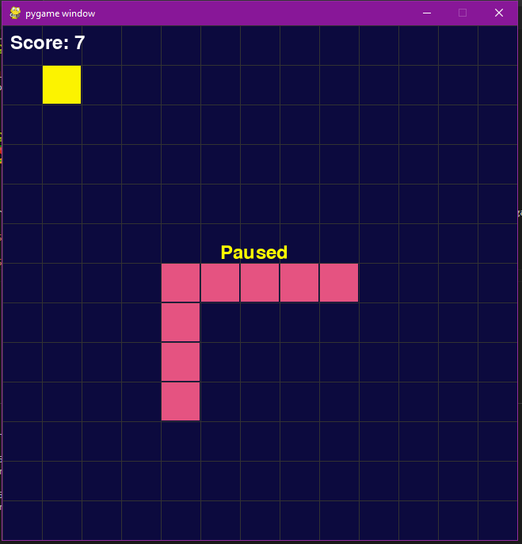
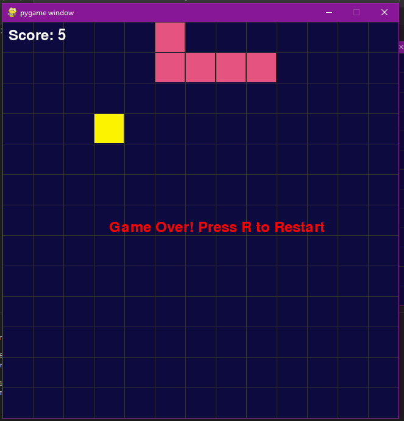

<h1 align="center"> 🐍 Snake Game - Python & Pygame </h1>


Welcome to the **Snake Game** built with Python and Pygame! 🎮 This is a recreation of the classic Snake game where you control a growing snake that eats food while avoiding collisions. A fun and educational project to practice Python game development!

## 🚀 Features

- 🐍 **Classic Snake Gameplay**: Control the snake, eat food, and grow!
- 🍎 **Food Spawn**: Randomly placed food items to increase your score.
- 🎨 **Simple graphics**: Easy on the eyes and fun to play!

## 📷 Screenshots

Here are some screenshots from the game in action! (Replace these paths with actual screenshots of your game.)

<div style="display: flex; justify-content: space-around;">
    
    
</div>

<div style="display: flex; justify-content: space-around;">
    <p>*The snake is getting longer after eating food!*</p>
    <p>*Watch out! Don't hit the walls or yourself!*</p>
</div>


## 🛠️ Installation

To run this project locally, follow these steps:

1. Clone this repository:
   ```bash
   git clone https://github.com/yourusername/snake-game-pygame.git
   ```
   
2. Navigate to the project directory:
    ```bash
    cd snake-game-pygame
    ```
    
3. Install the required dependencies:
    ```bash
    pip install pygame
    ```

4. Run the game:
    ```bash
    python main.py
    ```

## 🎮 Controls

* Move Up: W ⬆️
* Move Down: S ⬇️
* Move Left: A ⬅️
* Move Right: D ➡️
* Pause/Unpause: P ⏸️

## 📊 How to Play

* Control the snake using the W, A, S, D keys to eat food 🍎 and grow longer.
* Avoid hitting the walls or your own tail to keep the game going!
* The longer you survive, the higher your score will be! 🎉

## 📝 Credits
This project was inspired by a great tutorial by Coder Space. You can watch the full tutorial here:

[🔗 Watch the YouTube Tutorial](https://www.google.com/url?sa=t&rct=j&q=&esrc=s&source=web&cd=&cad=rja&uact=8&ved=2ahUKEwjjlMSYs6CJAxVpRDABHW-RHksQwqsBegQIDBAG&url=https%3A%2F%2Fm.youtube.com%2Fwatch%3Fv%3DpiAgNZ20MJ0&usg=AOvVaw0flxUVwaK_JGyom7etxxhJ&opi=89978449)

Special thanks to Coder Space for the amazing tutorial that guided this project. 🙌